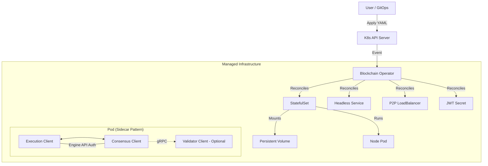

# Blockchain Node Operator 🚀

> A Production-Grade Kubernetes Operator for orchestrating Blockchain Infrastructure.
> 
> 
> Automates the lifecycle, security, and observability of Ethereum Full Nodes (Execution + Consensus layers).
> 

## 🌟 The Problem

Running blockchain nodes in production is hard. You have to manage:

- **Complex Architecture:** Coordinating Execution Clients (Geth) and Consensus Clients (Prysm).
- **Security:** Handling sensitive JWT tokens for Engine API authentication.
- **State Persistence:** Managing Terabytes of data with correct PVC bindings.
- **Network Identity:** Ensuring stable P2P identities and discovery.
- **Day-2 Operations:** Updates, drifts, and self-healing.

## 💡 The Solution

The **Blockchain Operator** codifies SRE operational knowledge into software. It treats an Ethereum Node as a first-class citizen in Kubernetes.

### Key Features

- ✅ **Intent-Based Types:** Just define the `nodeType` (e.g., `validator`, `gateway`), and the operator configures the topology, flags, and sidecars automatically.
- ✅ **GitOps Ready:** Declarative `EthereumNode` CRD.
- ✅ **The "Merge" Architecture:** Automatically deploys Geth + Prysm as sidecars with shared auth.
- ✅ **Self-Healing:** Detects configuration drift (e.g., deleted services, changed ports) and fixes it automatically.
- ✅ **Zero-Touch Security:** Auto-generates and manages secure JWT tokens for Engine API.
- ✅ **Observability:** Built-in Prometheus metrics for Block Height and Sync Status (`ethereum_node_block_height`).
- ✅ **Instant Sync:** Support for Checkpoint Sync to start validating in seconds, not days.

## 🏗 Architecture

The operator implements the **Reconcile Loop** pattern to enforce the desired state.



## 🚀 Getting Started

### Prerequisites

- Kubernetes Cluster (v1.24+)
- Helm v3+
- `kubectl`

### Installation (Via Helm)

We provide a production-ready Helm chart for easy installation.

```
# 1. Create the namespace
kubectl create namespace blockchain-operator-system

# 2. Install the Operator
helm install blockchain-operator ./deploy/charts/blockchain-operator \
  -n blockchain-operator-system

```

## Usage: Node Types

The operator supports 4 distinct node types optimized for different use cases. You don't need to manually configure flags; just pick a type!

| Type      | Description                                                                 | Implications                                                                 |
|-----------|-----------------------------------------------------------------------------|------------------------------------------------------------------------------|
| `full`     | A standard node that maintains current state and verifies blocks.         | Uses `snap` sync. Optimized for keeping up with the head of the chain.       |
| `archive`  | An archive node that retains all historical state data for querying the past. | Uses `archive` sync and GC mode. **Requires significantly more storage.**   |
| `validator`| A node that participates in Proof-of-Stake consensus by validating blocks. | Uses `snap` sync. **Automatically injects the Validator Client sidecar.**   |
| `gateway`  | A node optimized for high-volume JSON-RPC traffic.                         | Uses `snap` sync. Tunes API limits and resource allocation for serving dApps.|


### Example 1: Deploying a Full Node

Once the operator is running, deploying a full node is as simple as applying this manifest:

``` yaml
apiVersion: infra.blockchain.corp/v1
kind: EthereumNode
metadata:
  name: my-full-node
  namespace: blockchain-operator-system
spec:
  # Here is the magic: we only define the INTENTION of the node.
  # The operator will automatically set up Geth (snap) + Prysm.
  nodeType: full

  # Choose the network: mainnet, sepolia, or holesky
  network: "sepolia"

  # Number of replicas (Pods)
  replicas: 1

  # Disk size. 
  # For a Full Node on Sepolia or Mainnet, I recommend at least 500Gi of SSD/NVMe.
  storageSize: "500Gi"

  # Checkpoint Sync: Essential for the node to become "Ready" in minutes, not days.
  # This endpoint is public and reliable for the Sepolia network.
  checkpointSyncURL: "https://sepolia.beaconstate.info"

  # Recommended resources for a stable Full Node
  resources:
    requests:
      cpu: "2000m"  # 2 vCPUs guaranteed
      memory: "4Gi" # 4GB RAM guaranteed
    limits:
      cpu: "4000m"  # Up to 4 vCPUs at peak
      memory: "8Gi" # Up to 8GB RAM at peak
```

Apply it:

``` bash
kubectl apply -f config/samples/infra_v1_ethereumnode.yaml
```

### Example 2: Deploying a Validator Node

Automatically injects the Validator Client sidecar. Requires a secret named <node-name>-validator-keys with your keystores.

``` yaml
apiVersion: infra.blockchain.corp/v1
kind: EthereumNode
metadata:
  name: my-validator
  namespace: blockchain-operator-system
spec:
  nodeType: validator
  network: "sepolia"
  replicas: 1
  storageSize: "500Gi"
  checkpointSyncURL: "[https://sepolia.beaconstate.info](https://sepolia.beaconstate.info)"
  
  # Ensure you created the secret 'my-validator-validator-keys' beforehand!
```

## 🛠 Technical Deep Dive (For Engineers)

### Drift Detection Strategy

Unlike simple controllers that just create resources, this operator implements Semantic Drift Detection.

It calculates a SHA256 hash of the desired Spec and compares it with the live state. It creates patches only when strictly necessary, preventing infinite update loops and respecting Kubernetes defaults.

### Security Model

- **Cluster Scoped:** Can manage nodes across multiple namespaces.
- **RBAC:** Strictly scoped permissions (Least Privilege).
- **Secret Management:** If no `jwtSecretName` is provided, the operator uses `crypto/rand` to generate a cryptographically secure token and injects it into the Pods via a Volume Mount.

### Observability & SLOs

The operator exposes custom metrics on port `:8080` for Prometheus scraping.

| **Metric Name** | **Type** | **Description** |
| --- | --- | --- |
| `ethereum_node_reconcile_errors_total` | Counter | Failures in the reconciliation loop. |
| `ethereum_node_block_height` | Gauge | Real-time block height fetched via JSON-RPC. |

**Sample Alert (PromQL):**

```
# Alert if node is stuck (Block height not increasing)
rate(ethereum_node_block_height[5m]) == 0

```

## 🤝 Contributing

This project is built with [Kubebuilder](https://book.kubebuilder.io/).

1. **Clone:** `git clone https://github.com/mvleandro/blockchain-operator.git`
2. **Test:** `make test`
3. **Run Local:** `make run`
4. **Build Image:** `make docker-build`

## 📜 License

Apache 2.0 - See [LICENSE](./LICENSE) for details.

*Built with ❤️ by a [@mvleandro](https://github.com/mvleandro).*